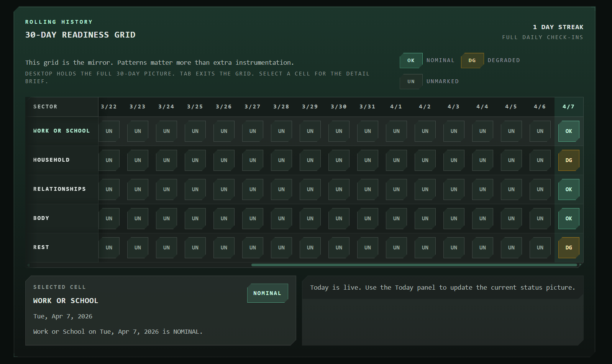
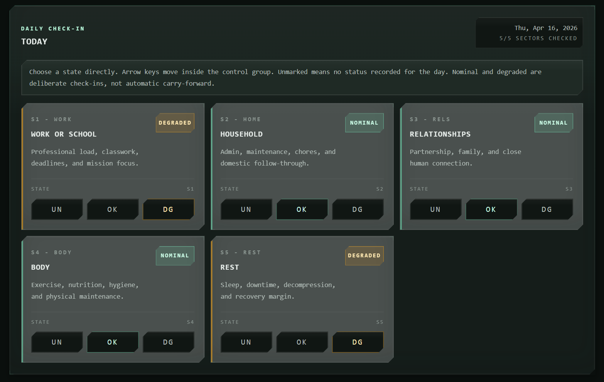
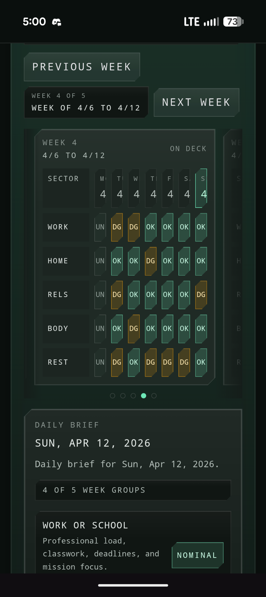

# OpsNormal

> **Local-only operator readiness tracking with deliberate constraints and integrity-verified recovery.**

<div align="center">

[](https://github.com/bradsaucier/opsnormal/actions/workflows/ci.yml) [](https://github.com/bradsaucier/opsnormal/actions/workflows/deploy.yml) [](./CHANGELOG.md) [](#trust-contract)

</div>

<p align="center">
  
</p>
<p align="center"><em>Figure 1. Desktop readiness grid showing the full 30-day picture, state legend, streak state, and selected-cell detail on the primary history surface.</em></p>

---

<a id="bluf"></a>

## Bottom Line Up Front (BLUF)

> [!IMPORTANT]
> **OpsNormal is an instrument built to preserve a usable daily readiness signal under a strict, local-only operating model.**
>
> It competes with a paper logbook, not a cloud service.
>
> Five fixed sectors. Three states. One trailing 30-day picture.
>
> There are no accounts, no backend data plane, no telemetry path, and no sync layer. State lives in IndexedDB. Durable recovery depends on operator-controlled JSON exports backed by integrity checks.
>
> The operating boundary is documented in [23 ADRs](./docs/decisions/README.md), a published [security and trust boundary](./SECURITY.md), and a release pipeline that publishes only the exact CI-verified production artifact.

## Operational model

OpsNormal records one of three states for each of five fixed sectors.

The model is intentionally coarse. The objective is a usable signal under stress, not exhaustive journaling.

### Sectors

| Sector         | Purpose                                  |
| -------------- | ---------------------------------------- |
| Work or School | Daily load from the main duty lane       |
| Household      | Home and admin pressure                  |
| Relationships  | Family, social, and close-support strain |
| Body           | Physical state and recovery              |
| Rest           | Sleep, decompression, and reset quality  |

### States

| State    | Meaning                                        |
| -------- | ---------------------------------------------- |
| Unmarked | No status recorded for that sector on that day |
| Nominal  | Holding together                               |
| Degraded | Needs attention                                |

---

<p align="center">
  
</p>
<p align="center"><em>Figure 2. Daily check-in surface enforcing the fixed five-sector model with direct state selection and immediate local commit behavior.</em></p>

---

## Operational philosophy and target operator

This instrument is engineered for operators who want deterministic local state tracking and who accept the backup burden that isolation requires.

Designed for operators who:

- want a fixed, legible readiness picture instead of feature sprawl
- prefer local control over hosted convenience
- will maintain their own export cadence and restore drills

Explicitly not designed for users seeking:

- cross-device cloud sync or account recovery
- passive telemetry, social features, or background data collection
- custom categories, free-form journaling, or browser storage treated like a guaranteed archive

These are not missing features. They are deliberate constraints that protect the operating model.

<a id="trust-contract"></a>

## Trust contract

OpsNormal runs on a shared-responsibility model. The repository makes hard commitments about data isolation, validation, and artifact integrity. The operator carries the burden of durable backup and safe handling of exported files.

### The repository commits to

- Core readiness records stay local to the device after the first successful load unless the operator exports them
- JSON and CSV export preserve an operator-controlled recovery path, and JSON exports carry a SHA-256 integrity envelope
- Import validates structure before commit, applies replace gating, and fails closed on malformed or unsafe data
- Root-level and section-level error boundaries preserve recovery surfaces and keep export reachable during localized render faults
- Release publication reuses the exact `dist-ci-verified` artifact that passed mainline integrity instead of rebuilding a new deploy bundle

### The operator commits to

- Browser-managed storage is not a backup system
- Private, incognito, and other ephemeral browsing modes do not provide persistent storage guarantees
- Exported readiness files are unencrypted plain text once they leave the browser sandbox. Protect them accordingly.
- Clearing site data, switching profiles, quota pressure, browser eviction, browser updates, and device loss can destroy records

Run a test export early. Export routinely. Keep important JSON exports in more than one location you control. When the shell raises a backup action prompt, treat it as a direct order to refresh the JSON export.

## Storage volatility and WebKit risks

OpsNormal uses IndexedDB for persistence. Local-only architecture means no external server can lose your readiness record. It also means no external server can save it. Browser-managed storage must be treated as an ephemeral cache, not a durable archive.

### Apple device operators

WebKit can purge script-writable storage for ordinary Safari tabs after seven days of Safari use without user interaction on the site. On Apple devices, that can destroy the readiness database and the browser-side timestamp that recorded the last export.

To reduce that risk:

- Install OpsNormal to the Home Screen before relying on it for sustained use on Apple devices
- Do not assume Home Screen installation makes data permanent. It mitigates the seven-day Safari-tab purge risk but does not remove storage volatility from browser-managed environments.
- Installing to Home Screen after entering data in Safari does not migrate existing data automatically
- If you already entered data in Safari on an Apple device, run a JSON export there first. Then install to Home Screen, open the installed app, and import that JSON file.
- If the app reopens looking like a clean install, restore immediately from the latest JSON export

## Mobile history proof

Narrow screens switch from the 30-day grid to week groups with a daily brief so the history surface stays readable on phone-sized viewports.

<p align="center">
  
</p>
<p align="center"><em>Figure 3. Mobile history surface proving week-paginated review and daily brief continuity under phone-sized viewport constraints.</em></p>

---

## Deployment and initialization

1. Open `https://opsnormal.app`
2. On Apple devices, install to Home Screen before entering data if you intend to rely on the app there
3. Record an initial status across the five fixed sectors in the environment you intend to keep using
4. Run a test JSON export and keep the file somewhere you control
5. Export routinely, especially before browser maintenance, profile changes, device transitions, or long periods of inactivity

### Apple device guidance

- If you are validating a Pages rollout or DNS cutover, the fallback deployment URL is `https://bradsaucier.github.io/opsnormal/`
- Ordinary Safari tabs are subject to WebKit purge behavior after seven days of Safari use without user interaction on the site
- On Apple devices, Safari browser tabs and installed Home Screen apps keep isolated website data
- If you already entered data in Safari on an Apple device, run a JSON export there first. Then install to Home Screen, open the installed app, and import that JSON file.

## Threat model and reliability posture

OpsNormal is a client-side application with no backend, no account system, and no cloud data plane. That changes the threat model. The primary security concerns are dependency supply chain risk, browser storage handling and eviction behavior, service worker correctness and update handoff, exported user data files once they leave the browser sandbox, static hosting configuration and build integrity, and Content Security Policy drift.

Local-only means no server can lose your readiness record. It also means no server can save it.

### Storage model

- Readiness data is stored in IndexedDB through Dexie
- The shell requests persistent storage through the Storage API when the browser exposes it, but grant behavior is browser-managed, not guaranteed, and does not override Safari-tab inactivity policy
- Same-origin asset fetches and service-worker lifecycle traffic still exist
- There is no backend data plane for readiness records

### Browser compatibility

Each row's verification-truth column states what the repo currently proves, not what it hopes will work.

| Browser surface             | Current posture        | Verification truth                                                               |
| --------------------------- | ---------------------- | -------------------------------------------------------------------------------- |
| Chromium-based browsers     | Supported              | Full Playwright Chromium coverage, production-artifact smoke, and release gating |
| Safari and other WebKit UIs | Supported with caveats | Merge-blocking and release WebKit smoke lanes prove engine compatibility only    |
| Firefox current release     | Expected to work       | Manual verification recommended because there is no dedicated Firefox CI lane    |

Read [WebKit CI coverage boundary](./docs/webkit-limitations.md) before making stronger Safari claims than the repo proves.

### Reliability posture

- Root-level and section-level error boundaries contain render faults instead of allowing full-application unmount and blank-screen failure
- Recovery surfaces keep JSON and CSV export reachable, including the crash-state export path documented in [ADR-0011](./docs/decisions/0011-react-error-boundaries-for-render-fault-containment.md) and [ADR-0016](./docs/decisions/0016-expand-sectional-error-boundaries-to-today-and-export.md)
- Backup action prompts escalate when Safari-tab risk, quota pressure, or storage instability make a fresh JSON export urgent
- Import validation, replace gating, and fail-closed commit verification prevent silent corruption
- Undo support remains available for data correction and pre-replace recovery drills

## Accessibility posture

Accessibility is architectural, not decorative.

- Skip link to the main surface
- Persistent live regions for state changes
- Radio-style direct selection controls with programmatic checked state
- Desktop history keyboard navigation and mobile day selection with a daily brief
- Focus treatment designed to stay visible on the clipped cockpit geometry
- State encoding that does not rely on color alone
- Dedicated WCAG 2.1 A and AA Playwright accessibility scans cover the desktop shell, the direct-select radiogroup pattern, and the mobile history region with service workers blocked for deterministic DOM evaluation
- ARIA snapshot coverage locks the direct-select radiogroup structure so intended accessibility-tree changes stay explicit in review

## Verification discipline

Quality is enforced through release gates, test coverage, and explicit design constraints.

- GitHub Actions runs lint, typecheck, Vitest coverage, Playwright Chromium verification, a merge-blocking Playwright WebKit smoke lane, and build validation
- GitHub Pages release downloads the `dist-ci-verified` artifact from the successful mainline integrity run, re-smokes that exact bundle in Chromium and WebKit, and only then publishes
- JSON export carries versioning and integrity checks, and import commit verification fails closed before the app claims success
- Save-picker pre-replace backups are read back before the app claims a verified disk write, and fallback Blob downloads keep a conservative delayed-revoke cleanup window
- Any database schema change must update the migration registry, migration tests, the relevant ADR, and browser-level upgrade proof before merge
- Playwright accessibility verification includes service-workers-blocked scans, and ARIA snapshots lock the direct-select radiogroup structure
- GitHub Actions dependencies are pinned to immutable SHAs, and CI fails on high-severity npm advisories through `npm audit --audit-level=high`
- ADRs, the risk register, the test plan, and the release checklist keep constraints visible so the repo cannot drift quietly

## Local build and verification

Prerequisites: Ensure the local environment meets the engine contract defined in `package.json`. `devEngines` enforces the local Node and npm baseline before install, ci, and run commands.

```bash
npm ci
npm run dev
```

Local verification and CI are aligned to supported LTS lines. For the full contribution workflow and merge expectations, read [CONTRIBUTING.md](./CONTRIBUTING.md).

```bash
npm run format:check
npm run lint
npm run typecheck
npm run test
npm run test:e2e
npm run test:e2e:webkit
npm run build
npm run test:e2e:smoke
```

`npm run format:check` verifies repository formatting with Prettier, and `npm run format` applies the repository formatting baseline locally. `npm run test:e2e` builds the e2e-mode harness bundle and runs the full Chromium suite. `npm run test:e2e:webkit` runs the narrow WebKit smoke gate that verifies rendering and IndexedDB I/O on a WebKit engine without claiming to reproduce Safari eviction behavior. Run `npm run build` before `npm run test:e2e:smoke` so the smoke command reuses a real production `dist/` build and skips the harness-only specs.

## Documentation matrix

This README stays focused on orientation and first use. Deeper proof, limits, and design constraints live in the repo docs.

| Document                                                        | What it covers                                                                                       |
| --------------------------------------------------------------- | ---------------------------------------------------------------------------------------------------- |
| [**Architecture overview**](./docs/architecture.md)             | Runtime shape, persistence model, recovery posture, PWA behavior, and known limits                   |
| [**Risk register**](./docs/risk-register.md)                    | Known operational risks, browser-storage hazards, and current mitigations                            |
| [WebKit CI coverage boundary](./docs/webkit-limitations.md)     | What the merge-blocking WebKit lane proves, what it cannot prove, and how to triage failures         |
| [**Architecture Decision Records**](./docs/decisions/README.md) | Why the repo chose IndexedDB, local-only boundaries, export integrity rules, and related constraints |
| [**Test plan**](./docs/test-plan.md)                            | Verification strategy, release checks, and coverage priorities                                       |
| [Release checklist](./docs/release-checklist.md)                | Pre-release validation and operator-facing quality gates                                             |
| [Changelog](./CHANGELOG.md)                                     | Public release history                                                                               |
| [Security policy](./SECURITY.md)                                | Security model, trust boundaries, and accurate claim limits                                          |
| [Design tokens](./docs/design-tokens.md)                        | Visual language, structural colors, state colors, and clipped geometry                               |
| [Contributing guide](./CONTRIBUTING.md)                         | Contribution rules that preserve repo scope                                                          |
| [Support policy](./SUPPORT.md)                                  | Question paths, vulnerability reporting, and funding posture                                         |
| [Code of conduct](./CODE_OF_CONDUCT.md)                         | Expected project conduct                                                                             |

These docs exist because the constraints are part of the product and should stay visible.

## Contribution parameters

If you want to contribute, stay inside the operating boundary.

- Keep the app local-only
- Do not add accounts, analytics, cloud sync, or background services
- Preserve the fixed five-sector model in the current product scope
- Update tests and docs when behavior changes

See [CONTRIBUTING.md](./CONTRIBUTING.md).

## License

See [LICENSE](./LICENSE).
