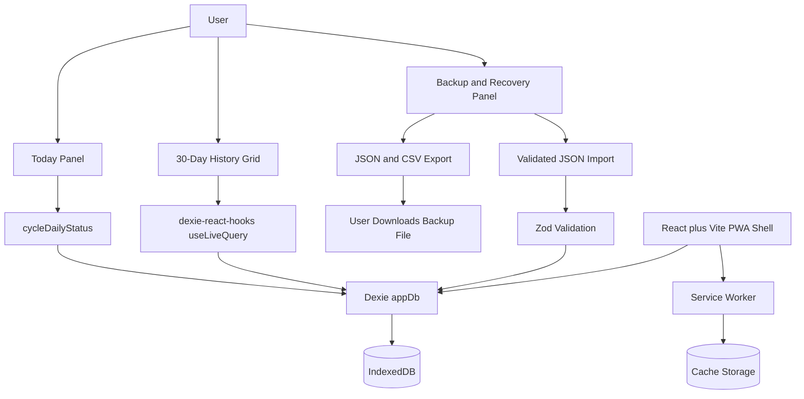

# OpsNormal

Local-first, offline-first daily readiness tracker. No account. No cloud sync. No analytics. Your data stays in the browser unless you explicitly export it.


```yaml
STATUS  : OPERATIONALLY READY
AUTHOR  : Bradley Saucier, SMSgt, USAF (Ret.)
LICENSE : MIT
```

[](https://github.com/bradsaucier/opsnormal/actions/workflows/deploy.yml)

---

<a id="bluf"></a>
## Bottom Line Up Front (BLUF)

> [!IMPORTANT]
> **OpsNormal is a deliberately narrow Progressive Web App built to answer one question fast: are the main sectors of life still holding together, or is something quietly degrading in the background.**
>
> The app uses a five-sector daily check-in, a three-state model, and a 30-day trailing grid to provide a fast operating picture without turning personal readiness into a gamified dashboard. The system is local-first by design. There is no backend, no account model, and no telemetry pipeline.
>

---

## Why this repo matters

Most personal tracking tools fail in one of two ways.

1. They collect too much and create friction.
2. They push data into a cloud stack the user never asked for.

OpsNormal takes the opposite path.

1. Daily interaction stays under ten seconds.
2. State is intentionally coarse: unmarked, nominal, degraded.
3. Persistence is browser-local through IndexedDB.
4. The PWA shell keeps the app usable offline after first load.
5. Export and validated import provide a real recovery path.

## Core operating model

### Fixed sectors

1. Work or School
2. Household
3. Relationships
4. Body
5. Rest

### Daily states

1. Unmarked
2. Nominal
3. Degraded

### Product boundaries

1. No accounts
2. No cloud sync
3. No third-party APIs
4. No journal requirement
5. No automated coaching layer
6. No medical or psychological claims

## Key capabilities

1. Five-sector daily check-in with single-click state cycling
2. 30-day readiness grid for pattern recognition
3. Local-only persistence through Dexie on top of IndexedDB
4. Installable PWA with offline app-shell caching
5. JSON export for backup and JSON import for recovery
6. CSV export for external review or spreadsheet work
7. Persistent storage request after the first meaningful save
8. CI-backed lint, typecheck, unit, integration, and end-to-end test posture

## Quick start

### Prerequisites

1. Node.js 20.19.0 or newer
2. npm 10 or newer

### Run locally

```bash
npm ci
npm run dev
```

### Verify locally

```bash
npm run lint
npm run typecheck
npm run test
npm run test:e2e
npm run build
```

## Architecture



### Runtime shape

1. React renders the Today panel, 30-day history grid, install guidance, update banner, and backup and recovery panel.
2. Daily writes flow through `cycleDailyStatus()` and `setDailyStatus()`.
3. Dexie persists entries into IndexedDB under a compound unique key.
4. `dexie-react-hooks` keeps the UI reactive without a separate client-side sync layer.
5. The service worker caches the app shell for offline reopen after first load.
6. Export creates explicit external backups. Import validates file contents before any write reaches IndexedDB.

### Tech stack

1. UI: React 19 + TypeScript
2. Build: Vite 7
3. Styling: Tailwind CSS 4
4. Persistence: Dexie 4 + IndexedDB
5. Runtime validation: Zod
6. Offline support: vite-plugin-pwa
7. Unit and integration tests: Vitest + fake-indexeddb
8. End-to-end tests: Playwright
9. Deployment: GitHub Actions to GitHub Pages

## Data model

OpsNormal stores one row per date and sector pair.

```ts
this.version(1).stores({
  dailyEntries: '++id, &[date+sectorId], date, sectorId, updatedAt'
});
```

### What that means

1. `++id` is an auto-increment primary key.
2. `&[date+sectorId]` is a unique compound key. A day can only have one row per sector.
3. `date` is stored as `YYYY-MM-DD` to avoid timezone drift across renders.
4. `updatedAt` stores an ISO timestamp for export and auditability.

### Type shape

```ts
export interface DailyEntry {
  id?: number;
  date: string;
  sectorId: 'work-school' | 'household' | 'relationships' | 'body' | 'rest';
  status: 'nominal' | 'degraded';
  updatedAt: string;
}
```

### State model rationale

The UI presents three states.

1. `unmarked`
2. `nominal`
3. `degraded`

The database stores only the two marked states. `unmarked` is represented by the absence of a row. That keeps the persistence layer smaller and makes reset semantics explicit.

## Backup and recovery

OpsNormal is local-first. That only works if recovery is real.

### Export

JSON export creates a versioned backup payload:

```json
{
  "app": "OpsNormal",
  "schemaVersion": 1,
  "exportedAt": "2026-03-28T00:00:00.000Z",
  "entries": []
}
```

CSV export is also available for external inspection and spreadsheet workflows.

### Import

JSON import is validated before any write reaches IndexedDB.

1. File size is checked first.
2. JSON parsing rejects malformed files.
3. Unsafe keys such as `__proto__`, `constructor`, and `prototype` are blocked.
4. Zod validates app name, schema version, timestamps, sector IDs, statuses, and duplicate date plus sector pairs.
5. The database write occurs inside a Dexie transaction.
6. Import supports two modes: merge and replace.
7. Undo restores the pre-import snapshot for the current session.

### Merge semantics

1. Merge keeps unrelated local entries.
2. Matching date plus sector pairs are overwritten by the imported file.
3. Replace clears the browser database and restores from the import payload.

## Data durability and storage posture

Browser-local storage is durable enough for a personal tool, but it is not the same thing as a cloud backup.

### What survives

1. Tab close and reopen
2. Browser restart
3. Offline use after first successful load and service worker registration

### What does not survive reliably

1. Manual browser data clearing
2. Profile deletion
3. Device loss
4. Some browser eviction policies on non-persistent storage
5. Safari storage eviction risk for non-installed iPhone and iPad usage

### Mitigations already in the repo

1. Install guidance is shown for better offline behavior and more durable local storage.
2. The app requests persistent storage after the first meaningful save instead of wasting the permission cycle on initial page load.
3. JSON and CSV export are available at any time.
4. The UI records the last completed external backup timestamp.
5. Import provides a real restore path instead of export-only theater.

### Operator guidance

1. Export routinely.
2. On iPhone and iPad, install to Home Screen.
3. Treat browser-local data as local working storage, not your only copy.

## Privacy and trust boundaries

OpsNormal is intentionally narrow in what it can do and what it is allowed to know.

1. No account system
2. No backend
3. No analytics or telemetry
4. No third-party API calls
5. No cloud sync
6. No data leaves the device unless the user explicitly exports it

The trust boundary is simple: after the app is loaded, the working data path is the browser, not a remote service.

## Accessibility and safety posture

1. State is not conveyed by color alone. Cells also use text markers.
2. Buttons maintain clear labels and focus-visible treatment.
3. Touch targets are sized for repeated daily use.
4. Reduced-motion users get instant transitions.
5. The app is a personal status tracker, not a medical device.
6. The app does not diagnose, treat, cure, or prevent any disease or condition.

## Testing and verification

### Test layers

1. Unit tests cover date utilities, export formatting, validation helpers, and import parsing rules.
2. Integration tests cover Dexie persistence behavior, compound key uniqueness, merge or replace import logic, and undo behavior with fake IndexedDB.
3. End-to-end tests cover daily check-in persistence, export and import flow, and offline reopen behavior through Playwright.

### Quality gates

```bash
npm run lint
npm run typecheck
npm run test
npm run test:e2e
npm run build
```

### Verification intent

The repo is not trying to prove feature quantity. It is trying to prove that a small local-first system behaves reliably under normal use, reload, offline reopen, export, and recovery.

## Deployment

OpsNormal is built as a static site and deployed through GitHub Actions.

### Deployment posture

1. `vite build` produces the production artifact.
2. The PWA plugin generates the service worker and manifest assets.
3. GitHub Pages hosts the static output.
4. `index.html` is copied to `404.html` so first navigation on GitHub Pages still resolves for SPA routes before the service worker takes over.
5. The service worker checks for updates on an interval and the UI surfaces a reload banner when a fresh version is ready.

## Repository standards

1. `CONTRIBUTING.md` defines contribution rules and quality gates.
2. `SECURITY.md` defines vulnerability reporting expectations.
3. `CODE_OF_CONDUCT.md` defines community baseline.
4. `docs/architecture.md` captures the architectural posture.
5. `docs/test-plan.md` captures verification intent.
6. `docs/risk-register.md` records platform and operational risks.
7. `docs/release-checklist.md` defines pre-release verification steps.
8. `docs/decisions/` is the correct place for ADRs and architectural records.

## Roadmap pressure that will stay resisted

This repo is stronger because it says no.

1. No cloud account creep
2. No score addiction layer
3. No forced journaling workflow
4. No feature bloat that breaks the ten-second daily interaction

## License

MIT
